Mục tiêu bài thực hành là thiết lập môi trường MongoDB Atlas, cài đặt MongoDB Compass, kết nối với cluster, và thực hành các thao tác cơ bản và nâng cao (CRUD) của MongoDB.
Công cụ/Môi trường sử dụng: MongoDB Atlas, MongoDB Compass, MONGOSH(trong MongoDB Compass)
# Bài 1: Thiết lập môi trường

## 1.1 Đăng ký tài khoản MongoDB Atlas và tạo cluster miễn phí trên dịch vụ đám mây

Vào https://www.mongodb.com/cloud/atlas/register để đăng ký tài khoản.

  
*Hình 1.1: Trang đăng ký tài khoản MongoDB Atlas*

Sau khi đăng ký thành công sẽ vào giao diện như sau:

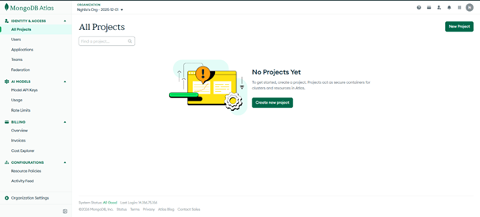  
*Hình 1.2: Giao diện MongoDB sau khi đăng ký thành công*

Để tạo cluster miễn phí ta tiến hành các bước như sau:

### Tạo Project:

- Điền thông tin tên Project và thêm Tags(tùy chọn)

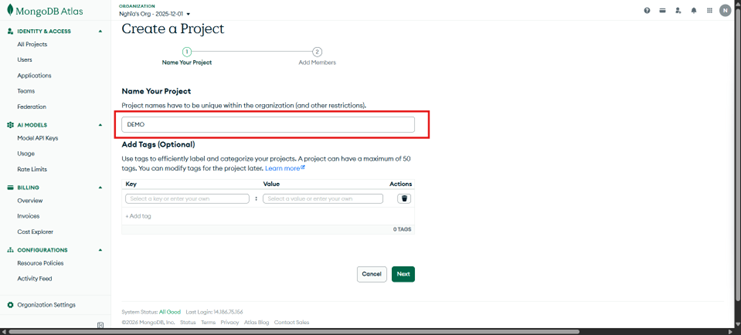  
*Hình 1.3: Điền tên và tags cho project*

- Thêm thành viên(tùy chọn)

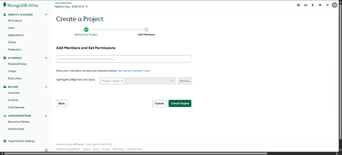  
*Hình 1.4: Thêm thành viên để set quyền(tùy chọn)*

- Chọn Create Project để tạo project

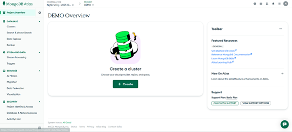  
*Hình 1.5: Tạo project(DEMO) thành công*

### Tạo Cluster:

Tại giao diện Deploy your cluster, tiến hành cấu hình và triển khai MongoDB Cluster trên nền tảng cloud. Trong bài thực hành này, lựa chọn Free Tier để tạo cluster nhằm phục vụ mục đích học tập và thử nghiệm.

Các thông số cấu hình được thiết lập như sau:

- Cluster Type: Free Tier
- Cluster Name: Cluster0
- Cloud Provider: AWS
- Region: Singapore (ap-southeast-1)
- Storage: 512 MB
- RAM: Shared
- vCPU: Shared

Ngoài ra, hệ thống bật các tùy chọn Automate security setup và Preload sample dataset trong phần Quick setup để hỗ trợ thiết lập bảo mật tự động và nạp dữ liệu mẫu.

Sau khi hoàn tất cấu hình, nhấn Create Deployment để MongoDB Atlas tiến hành triển khai cluster.

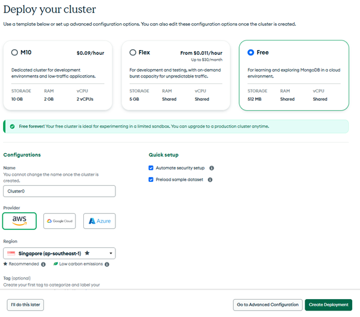  
*Hình 1.6: Các bước Deploy Cluster*

Sau khi khởi tạo thành công, hệ thống cung cấp một môi trường cơ sở dữ liệu chạy trên cloud.

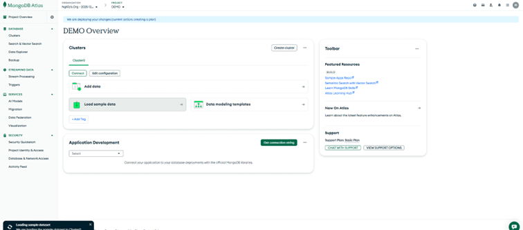  
*Hình 1.7: Tạo Cluster thành công* 

## 1.2 Tìm nạp dữ liệu mẫu trên MongoDB Atlas vào cluster

MongoDB Atlas cung cấp sẵn các bộ dữ liệu mẫu (Sample Dataset) để người dùng thực hành truy vấn và kiểm thử hệ thống mà không cần tự tạo dữ liệu ban đầu.

Tại Cluster đã tạo, chọn tùy chọn Load Sample Dataset. Sau vài phút, hệ thống sẽ tự động thêm các cơ sở dữ liệu mẫu vào cluster.

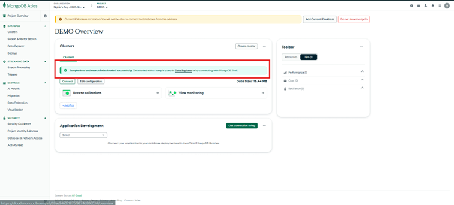  
*Hình 1.8: Giao diện sau khi đã thêm sample data vào cluster thành công*

Tiếp theo chọn Browse collection để kiểm tra dữ liệu mới thêm vào:

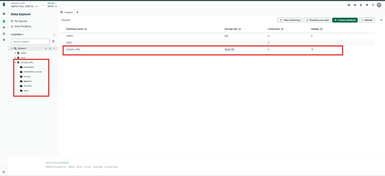  
*Hình 1.9: Giao diện dữ liệu mẫu sample_mflix khi được thêm vào Cluster*

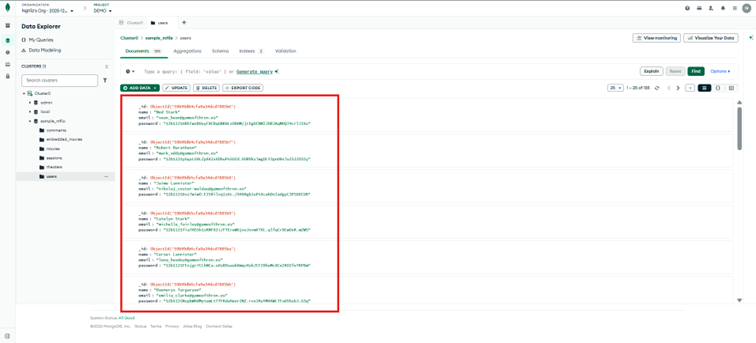  
*Hình 1.10: Giao diện dữ liệu collection users của database sample_mflix*
## 1.3 Cài đặt MongoDB Compass trên máy tính

Các bước cài đặt:

- Truy cập trang tải MongoDB: https://www.mongodb.com/try/download/compass

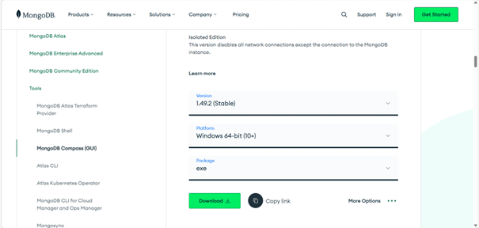  
*Hình 1.11: Trang tải MongoDB Compass*

- Chọn:
  - Version: 1.49.2 (Stable)
  - OS: Windows (hoặc hệ điều hành đang sử dụng)
  - Package: .exe

- Nhấn Download để tải file cài đặt.

- Sau khi tải xong:
  - Chạy file .exe
  - Chọn "Install"
  - Hoàn tất quá trình cài đặt

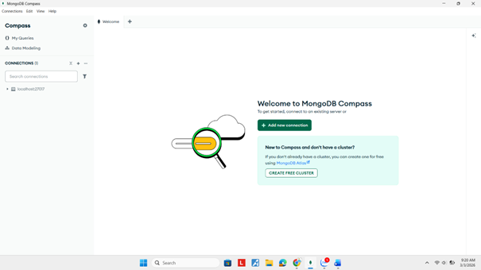  
*Hình 1.12: Giao diện MongoDB Compass sau khi đã cài trên máy*
## 1.4 Kết nối MongoDB Compass với cluster đã tạo trên MongoDB Atlas

### Bước 1: Lấy Connection String từ MongoDB Atlas

- Đăng nhập vào MongoDB Atlas.
- Vào mục Database.
- Tại Cluster đã tạo, chọn Connect.
- Chọn Connect using MongoDB Compass.
- Sao chép Connection String được cung cấp.

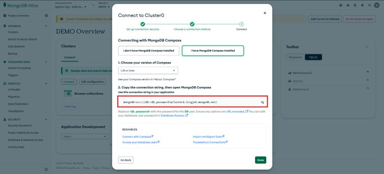  
*Hình 1.13: Lấy Connection String được cung cấp*

### Bước 2: Kết nối bằng MongoDB Compass

- Mở MongoDB Compass.
- Dán Connection String vào ô kết nối.
- Thay `<username>` và `<password>` bằng thông tin Database User đã tạo.
- Nhấn Connect.

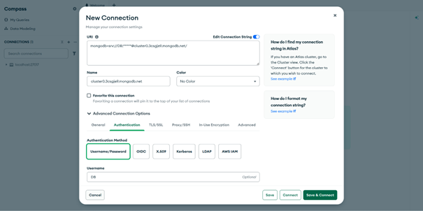  
*Hình 1.14: Dán Connect String vào ô kết nối và thay username và password bằng thông tin đã tạo*

### Kết quả

- Giao diện MongoDB Compass hiển thị danh sách các database trong cluster.
- Có thể truy cập và thao tác với các collection.
- Trạng thái hiển thị kết nối thành công tới cluster Atlas.

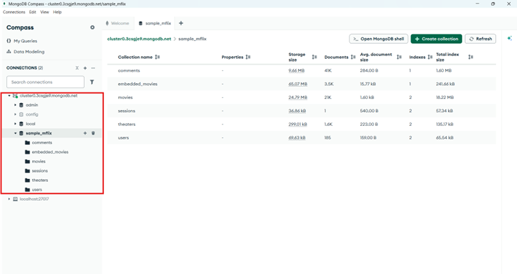  
*Hình 1.15: Giao diện sau khi thành công kết nối MongoDB Compass với cluster đã tạo trên MongoDB Atlas*
# Bài 2: Thực hành với MongoDB

**Lưu ý:** các bài tập dưới đây không sử dụng giao diện để thêm trực tiếp dữ liệu, hãy dùng công cụ MONGOSH có trong MongoDB Compass hoặc Mongo Shell để thực hiện việc này.

## 2.1 Tạo cơ sở dữ liệu có tên MSSV-IE213 trên cluster của bạn

Trong đó MSSV là mã số sinh viên của bạn.

Tạo cơ sở dữ liệu có tên theo mã số sinh viên với định dạng: `use MSSV-IE213` và kiểm tra lại database đang dùng bằng lệnh `db`

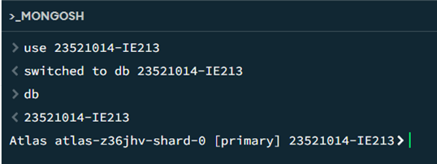  
*Hình 2.1: Tạo cơ sở dữ liệu có tên 23521014-IE213*
## 2.2 Thêm các document sau đây vào collection có tên là employees trong db vừa được tạo ở trên

```json
{"id":1,"name":{"first":"John","last":"Doe"},"age":48}
{"id":2,"name":{"first":"Jane","last":"Doe"},"age":16}
{"id":3,"name":{"first":"Alice","last":"A"},"age":32}
{"id":4,"name":{"first":"Bob","last":"B"},"age":64}
```

Thêm 4 document vào collection employees.

- `insertMany()` dùng để thêm nhiều document cùng lúc.
- Nếu collection chưa tồn tại, MongoDB sẽ tự động tạo.

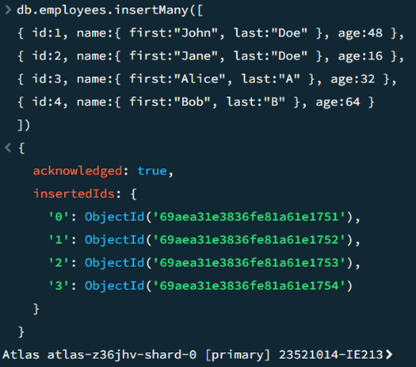  
*Hình 2.2: Thêm 4 document vào collection employees*
## 2.3 Hãy biến trường id trong các document trên trở thành duy nhất

Có nghĩa là không thể thêm một document mới với giá trị id đã tồn tại.

Thiết lập index để đảm bảo không thể thêm document có id trùng lặp.

**Giải thích:**

- `{ id: 1 }` → tạo index tăng dần theo id
- `{ unique: true }` → đảm bảo không trùng giá trị

**Kiểm tra:**

```javascript
db.employees.insertOne({ id: 2, name: { first: "Test", last: "User" }, age: 25 })
```

**Kết quả:**

```
E11000 duplicate key error collection
```

→ Điều này chứng minh ràng buộc unique đã hoạt động chính xác.

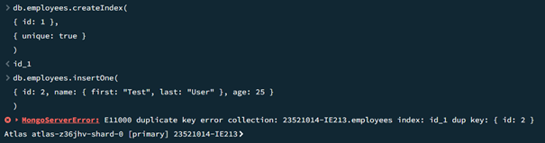  
*Hình 2.3: Biến trường ID trở thành duy nhất và test thử*
## 2.4 Hãy viết lệnh để tìm document có firstname là John và lastname là Doe

Để tìm document có firstname là John và lastname là Doe, sử dụng lệnh `find()` với bộ lọc theo các trường lồng nhau `name.first` và `name.last`.

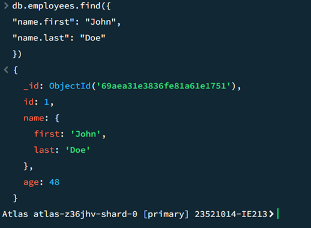  
*Hình 2.4: Lệnh tìm document có firstname là John và lastname là Doe*
## 2.5 Hãy viết lệnh để tìm những người có tuổi trên 30 và dưới 60

Sử dụng lệnh `find()` kết hợp toán tử `$and` để lọc các document có age > 30 và age < 60.

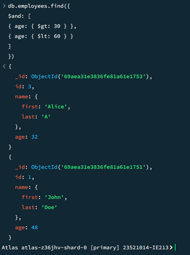  
*Hình 2.5: Lệnh để tìm những người có tuổi trên 30 và dưới 60*
## 2.6 Thêm các document sau đây vào collection

```json
{"id":5,"name":{"first":"Rooney", "middle":"K", "last":"A"},"age":30}
{"id":6,"name":{"first":"Ronaldo", "middle":"T", "last":"B"},"age":60}
```

Sau đó viết lệnh để tìm tất cả các document có middle name.

Thêm hai document mới vào collection employees:

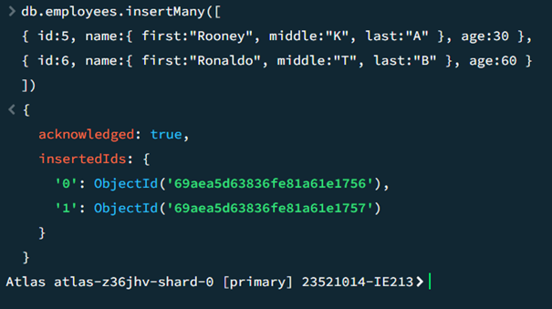  
*Hình 2.6: Thêm 2 document mới*

Sau đó tìm các document có middle name bằng toán tử `$exists`.

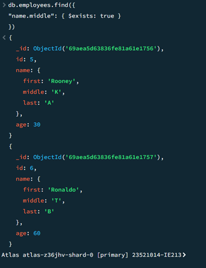  
*Hình 2.7: Tìm các document có middle name bằng toán tử $exists*
## 2.7 Cho rằng là những document nào đang có middle name là không đúng, hãy xoá middle name ra khỏi các document đó

Do middle name được xem là không cần thiết, tiến hành xóa trường này khỏi các document bằng toán tử `$unset`.

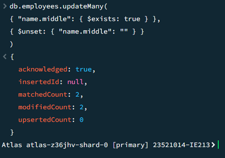  
*Hình 2.8: Xóa middle name ra khỏi document*
## 2.8 Hãy thêm trường dữ liệu organization: "UIT" vào tất cả các document trong employees collection

Thêm trường organization: "UIT" cho toàn bộ document trong collection employees bằng lệnh `updateMany()`.

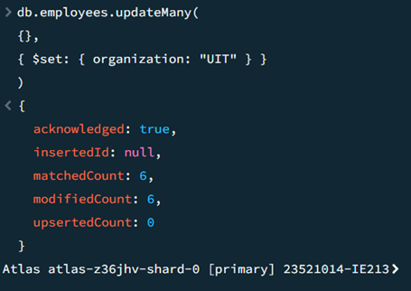  
*Hình 2.9: Thêm trường dữ liệu organization "UIT" cho tất cả document trong employees collection*
## 2.9 Hãy điều chỉnh organization của nhân viên có id là 5 và 6 thành "USSH"

Thay đổi giá trị organization của các nhân viên có id là 5 và 6 thành USSH.

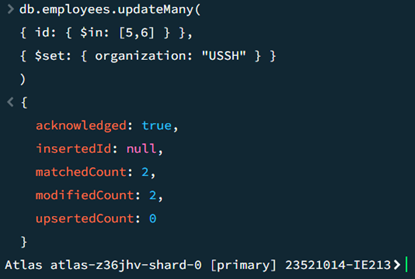  
*Hình 2.10: Thay đổi organization của nhân viên có id là 5 và 6 thành "USSH"*
## 2.10 Hãy viết lệnh để tính tổng tuổi và tuổi trung bình của nhân viên thuộc 2 organization là UIT và USSH

Sử dụng `aggregate()` kết hợp toán tử `$group` để tính tổng tuổi và tuổi trung bình của nhân viên theo từng organization.

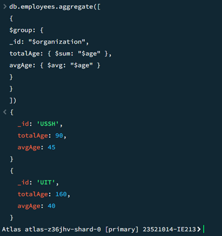  
*Hình 2.11: Lệnh để tính tổng tuổi và tuổi trung bình của nhân viên thuộc 2 organization là UIT và USSH*
