Mục tiêu bài thực hành là thiết lập môi trường Node.js, khởi tạo backend cho ứng dụng Movie Reviews và từng bước xây dựng các thành phần API kết nối MongoDB Atlas.  
Công cụ/Môi trường sử dụng: Node.js, Visual Studio Code, MongoDB Atlas, Express, MongoDB Driver.  

# Bài 1: Thiết lập môi trường

## 1.1 Tải và cài đặt Node.js

Tải Node.js tại: https://nodejs.org/en/download.

Các bước thực hiện:

- Truy cập trang cài đặt Node.js.
- Chọn phiên bản phù hợp.
- Tải file cài đặt Windows Installer (`.msi`) phù hợp với hệ điều hành Windows.
- Tiến hành cài đặt theo hướng dẫn của trình cài đặt.
- Sau khi cài đặt hoàn tất, mở Command Prompt hoặc PowerShell và kiểm tra phiên bản bằng lệnh `node -v`.

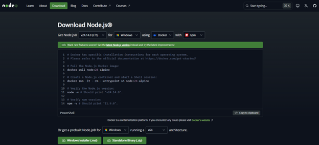  
*Hình 1.1: Trang cài đặt Node.js*

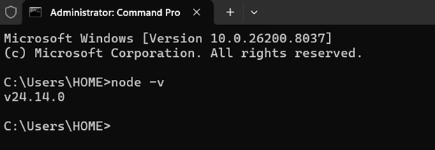  
*Hình 1.2: Cửa sổ Command Prompt kiểm tra phiên bản Node.js*

## 1.2 Cài đặt công cụ soạn thảo mã nguồn

Có thể sử dụng một trong các công cụ như Visual Studio Code, Sublime Text, Notepad++,...

Các bước thực hiện:

- Truy cập trang tải Visual Studio Code: https://code.visualstudio.com/.
- Nhấn **Download for Windows** để tải file cài đặt.
- Mở file cài đặt và thực hiện theo các bước hướng dẫn.
- Sau khi cài đặt hoàn tất, mở Visual Studio Code.

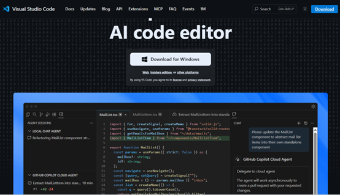  
*Hình 1.3: Trang cài đặt Visual Studio Code*

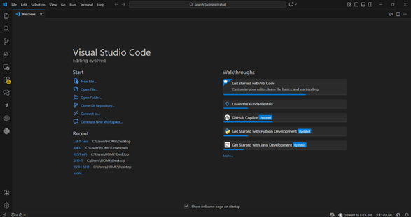  
*Hình 1.4: Giao diện Visual Studio Code*

## 1.3 Khởi tạo cây thư mục mã nguồn dự án

Ví dụ cấu trúc thư mục: `movie-reviews/backend`.

Mô tả:

- `movie-reviews`: thư mục gốc của dự án.
- `backend`: chứa mã nguồn backend.

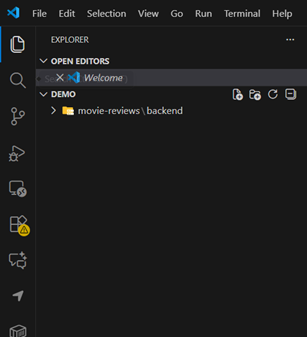  
*Hình 1.5: Cấu trúc thư mục của dự án*

## 1.4 Khởi tạo dự án với `npm init`

Di chuyển vào thư mục `backend` và chạy lệnh `npm init`.

Sau khi chạy lệnh, hệ thống sẽ yêu cầu nhập các thông tin dự án như:

- `name`
- `version`
- `description`
- `entry point`
- `test command`
- `git repo`
- `keyword`
- `author`
- `license`
- `type`

Sau khi hoàn thành sẽ tạo file `package.json`.

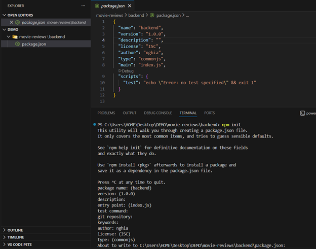  
*Hình 1.6: Khởi tạo dự án với npm init*

## 1.5 Cài đặt dependency cho dự án

Tiến hành cài đặt các thư viện:

- `mongodb`
- `express`
- `cors`
- `dotenv`

Lệnh cài đặt:

`npm install mongodb express cors dotenv`

Sau khi cài đặt, các thư viện sẽ được lưu trong thư mục `node_modules` và được ghi vào file `package.json`.

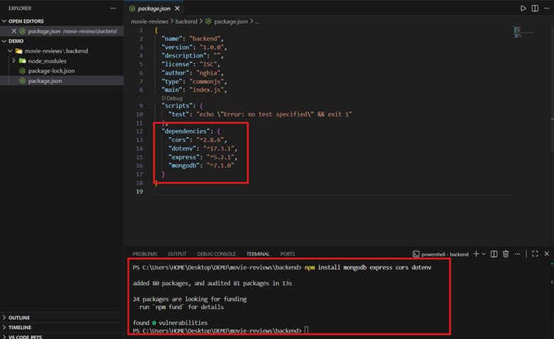  
*Hình 1.7: Cài đặt các dependency của dự án*

## 1.6 Cài đặt `nodemon`

`nodemon` là công cụ giúp khởi động lại máy chủ web khi có sự thay đổi về mã nguồn.

Các bước thực hiện:

- Mở cửa sổ dòng lệnh (Command Prompt, PowerShell hoặc Terminal).
- Cài đặt Nodemon bằng lệnh `npm install -g nodemon`.
- Kiểm tra đã cài đặt thành công bằng lệnh `nodemon -v`.

Trong đó:

- `npm`: công cụ quản lý package của Node.js.
- `-g`: cài đặt Nodemon ở chế độ global để có thể sử dụng ở mọi dự án.

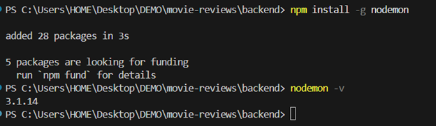  
*Hình 1.8: Cài đặt và kiểm tra đã cài nodemon*

# Bài 2: Xây dựng backend Movie Reviews

## 2.1 Tạo tệp `server.js` để khởi tạo máy chủ web

Tệp `server.js` nằm trong thư mục `backend`.

Yêu cầu:

- Thêm các dependency như `express`, `cors` để sử dụng middleware.
- Chứa một số routing cơ bản cho máy chủ web như xử lý lỗi `404`, định tuyến tới `/api/v1/movies` (xem phần 2.4).

Trong thư mục `backend`, tạo file `server.js`.

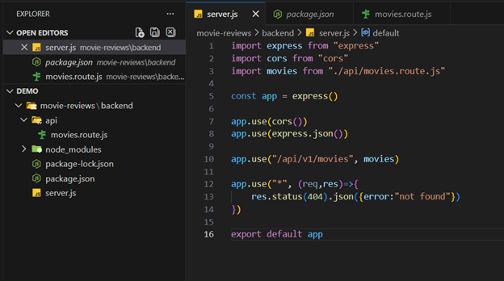  
*Hình 2.1: Nội dung code trong file server.js*

Giải thích:

Tệp `server.js` dùng để khởi tạo và cấu hình máy chủ Express cho ứng dụng.

Cấu trúc gồm các phần chính:

- Import thư viện: thêm các thư viện cần thiết như `express`, `cors`.
- Khởi tạo server: tạo ứng dụng Express bằng `const app = express()`.
- Middleware: sử dụng `cors()` và `express.json()` để xử lý dữ liệu request từ client.
- Routing: thiết lập các đường dẫn API như `/api/v1/movies` và xử lý lỗi `404`.
- Export module: `export app` để sử dụng ở các tệp khác trong hệ thống.

## 2.2 Tạo tệp `.env` lưu biến môi trường

Tạo file `.env` trong thư mục `backend` để lưu các thông tin như URI kết nối DB trên MongoDB Atlas và cổng dịch vụ web (ví dụ `3000`).

Các bước lấy URI kết nối:

- Vào MongoDB Atlas.
- Chọn Cluster đã tạo.
- Chọn **Connect** → **Connect to your application**.
- Sao chép URL kết nối.

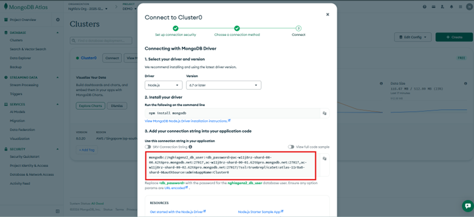  
*Hình 2.2: Lấy URL kết nối trên MongoDB Atlas*

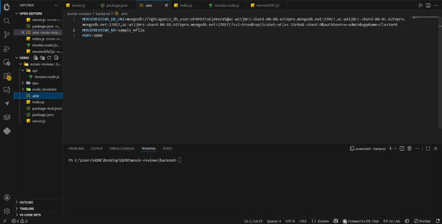  
*Hình 2.3: Nội dung file .env*

Ý nghĩa các biến:

| Biến | Chức năng |
| --- | --- |
| `MOVIEREVIEWS_DB_URI` | Link kết nối MongoDB |
| `MOVIEREVIEWS_NS` | Tên database |
| `PORT` | Cổng server |

## 2.3 Tạo tệp `index.js` để kết nối dữ liệu và chạy máy chủ

Tạo file `index.js` trong thư mục `backend`, dùng để kết nối database và chạy server.

Giải thích:

Tệp `index.js` dùng để kết nối MongoDB và khởi động server Express cho ứng dụng.

Cấu trúc gồm các phần chính:

- Import thư viện: thêm `server.js`, `mongodb`, `dotenv`.
- Đọc biến môi trường: dùng `dotenv.config()` để lấy URI database và PORT từ `.env`.
- Kết nối MongoDB: tạo `MongoClient` và thực hiện `client.connect()`.
- Chạy server: dùng `app.listen(port)` để khởi động server.
- Xử lý lỗi: sử dụng `try...catch` để bắt lỗi khi chạy chương trình.

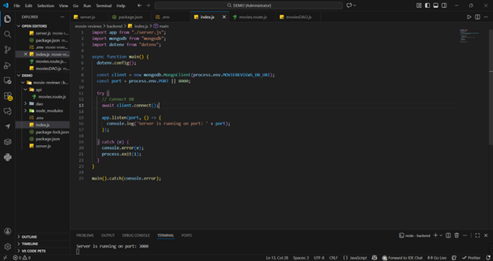  
*Hình 2.4: Nội dung file index.js*

## 2.4 Tạo route `api/movies.route.js`

Tạo thư mục và tệp tin tương ứng trong thư mục `backend`, gồm `api/movies.route.js` để xử lý các định tuyến liên quan đến ứng dụng minh hoạ movies.

Hiện tại tạo một định tuyến duy nhất `/` trả về cho máy khách thông báo `hello world`.

Ví dụ máy khách truy cập `localhost:3000/api/v1/movies` thì sẽ trả về `hello world`.

Trong thư mục `backend`, tạo thư mục `api`, sau đó tạo file `movies.route.js`.

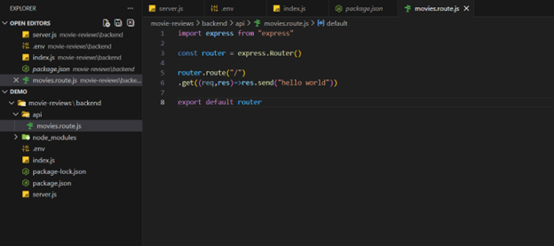  
*Hình 2.5: Nội dung file movies.route.js*

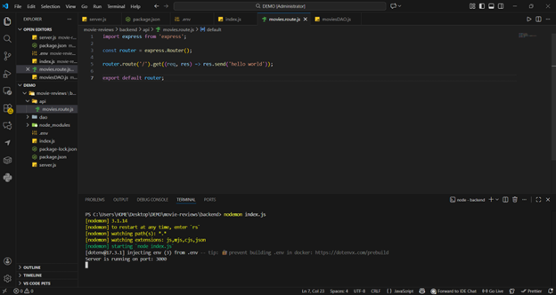  
*Hình 2.6: Test chạy server*

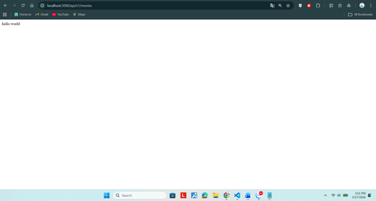  
*Hình 2.7: Màn hình hiển thị test thành công*

## 2.5 Thiết lập DAO (Data Access Object)

Thiết lập công cụ truy xuất dữ liệu cho ứng dụng Movie với DAO.

Yêu cầu:

- Tạo thư mục `dao` trong `backend`, tạo tệp `moviesDAO.js` trong thư mục này.
- Tệp `moviesDAO.js` bao gồm class `MoviesDAO` chứa 2 phương thức chính:
	- `injectDB()`: tham chiếu tới dữ liệu collection `movies` trên `sample_mflix`.
	- `getMovies()`: trả về danh sách `movies` và số lượng qua 2 tham số `moviesList`, `totalNumMovies`, với bộ lọc mặc định: không có bộ lọc, bắt đầu trang `0`, mỗi trang tối đa `20` phim.
- Khởi tạo đối tượng lớp `MoviesDAO` trong `index.js` để sử dụng `injectDB()`.
- Phương thức này được gọi sau khi kết nối MongoDB Atlas Cloud và trước khi máy chủ chạy.

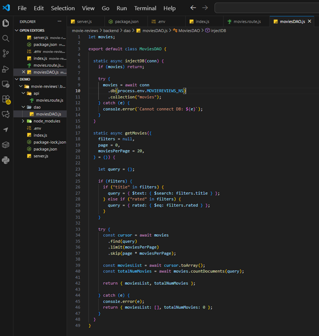  
*Hình 2.8: Nội dung file moviesDAO.js*

Giải thích:

Tệp `moviesDAO.js` chứa lớp `MoviesDAO` để làm việc với collection `movies`.

`injectDB()`:

- Kết nối đến database và lấy collection `movies`.
- Chỉ thực hiện một lần khi server khởi động.

`getMovies()`:

- Lấy danh sách phim từ database.
- Hỗ trợ filter (`title`, `rated`).
- Có phân trang với `limit` và `skip`.
- Trả về:
	- `moviesList`: danh sách phim.
	- `totalNumMovies`: tổng số phim.

Khởi tạo DAO:

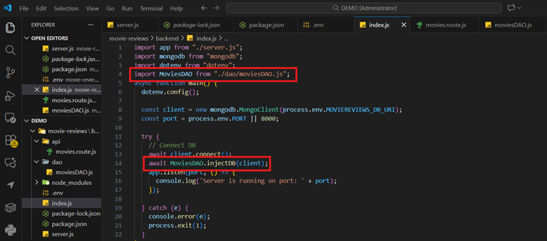  
*Hình 2.9: Khởi tạo DAO sau khi kết nối DB trong file index.js*

- Sau khi kết nối MongoDB, gọi `await MoviesDAO.injectDB(client);` để truyền kết nối vào DAO trước khi chạy server.

## 2.6 Thiết lập Controller cho ứng dụng web

Tạo tệp `movies.controller.js` trong thư mục `api` để thực hiện tác vụ trung gian: nhận yêu cầu từ máy khách qua API (endpoint), sau đó định tuyến tới function phù hợp trong DAO.

Trong class `MoviesController`, tạo function `apiGetMovies()` trả về chuỗi JSON cho máy khách. Trong function này có bước gọi hàm `getMovies()` đã định nghĩa trong DAO Movie.

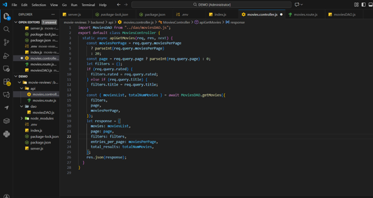  
*Hình 2.10: Nội dung file movies.controller.js*

Giải thích:

Tệp controller dùng để xử lý request từ client và trả về response.

Phương thức `getMovies()`:

- Nhận request từ client.
- Gọi `MoviesDAO.getMovies()` để lấy dữ liệu.
- Trả kết quả về cho client dưới dạng JSON.

Xử lý dữ liệu nhận:

- Nhận các tham số như `page`, `filters` từ request.
- Truyền xuống DAO để truy vấn dữ liệu.

Response:

- Trả về danh sách phim (`moviesList`).
- Kèm tổng số phim (`totalNumMovies`).

## 2.7 Đưa Controller vào định tuyến

Ví dụ, khi máy khách gửi HTTP request `localhost:3000/api/v1/movies/` thì máy chủ web sẽ gọi hàm `apiGetMovies` trong `MoviesController` để xử lý và trả dữ liệu trên browser.

Thực hiện:

- Import `MoviesController`.
- Khai báo router và định tuyến đường dẫn `/api/v1/movies`.

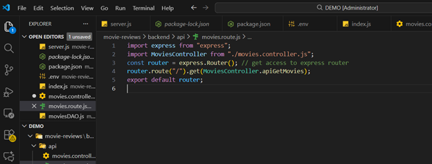  
*Hình 2.11: Nội dung file movies.route.js sau khi import MoviesController*

Kiểm tra chức năng:

- Test trên trình duyệt URL: http://localhost:3000/api/v1/movies.

Kết quả:

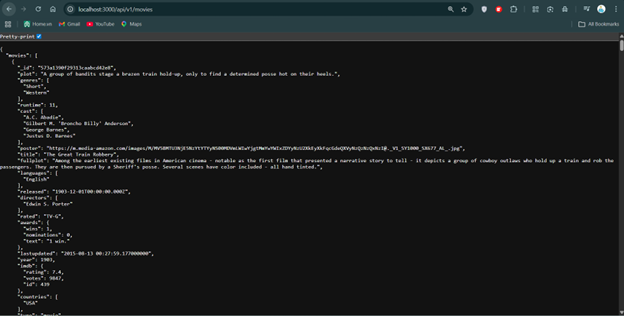  
*Hình 2.12: Kết quả hiển thị danh sách movies trên trình duyệt*

Giải thích kết quả:

- Server nhận request từ client.
- Route chuyển request đến Controller.
- Controller gọi DAO để lấy dữ liệu từ MongoDB.
- Dữ liệu được trả về dưới dạng JSON.
