# Mục tiêu

Bài thực hành này tập trung vào việc hoàn thiện ứng dụng Movie Reviews với backend Node.js, Express và MongoDB Atlas, bao gồm thiết lập route, controller, DAO và kiểm thử API.

---

# Bài 1: Thiết lập định tuyến cho các thao tác với review trong ứng dụng minh hoạ

Thiết lập các route trong `movies.route.js` để xử lý các thao tác CRUD (Create, Read, Update, Delete) cho review trong ứng dụng.

Các route đã được thiết lập như sau:

- `router.route("/review")`: định nghĩa đường dẫn `/review`
- `.post(ReviewsController.apiPostReview)`: xử lý request `POST` - thêm review mới
- `.put(ReviewsController.apiUpdateReview)`: xử lý request `PUT` - cập nhật review hiện có
- `.delete(ReviewsController.apiDeleteReview)`: xử lý request `DELETE` - xoá review

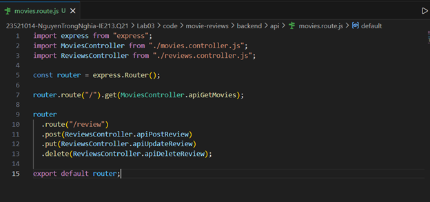  
*Hình 1.1: Mã code trong `movies.route.js`*

---

# Bài 2: Thiết lập Controller cho review

Tạo tệp `reviews.controller.js` trong thư mục `api` để xử lý các yêu cầu liên quan đến review từ phía máy khách. Tệp này import `ReviewsDAO` từ `../dao/reviewsDAO.js` nhằm gọi các hàm tương tác với cơ sở dữ liệu. Xây dựng class `ReviewsController` gồm các phương thức để thêm, sửa và xoá review.

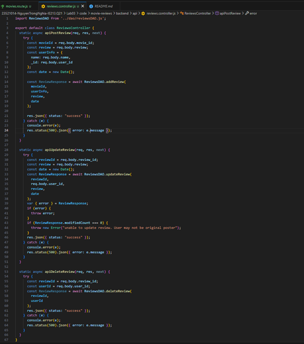  
*Hình 2.1: Mẫu code trong `reviews.controller.js`*

---

# Bài 3: Thiết lập DAO cho Reviews

Tạo tệp `reviewsDAO.js` để xử lý dữ liệu review trên MongoDB, gồm các chức năng: kết nối collection, thêm review, cập nhật review và xoá review. Đồng thời, cập nhật `index.js` để gọi `ReviewsDAO.injectDB(client)` sau khi kết nối database và trước khi khởi chạy server nhằm đảm bảo hệ thống sẵn sàng thao tác dữ liệu.

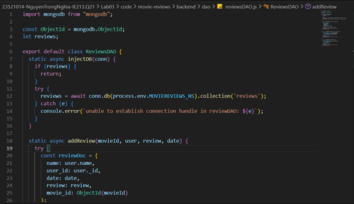  
*Hình 3.1: Mẫu code phương thức `injectDB()` trong `reviewsDAO.js`*

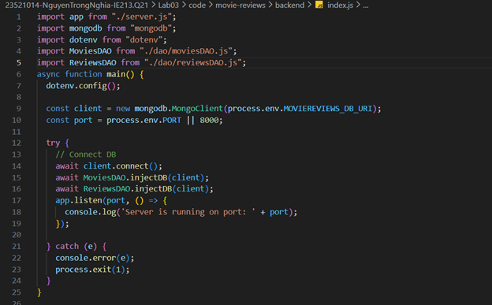  
*Hình 3.2: Mẫu code gọi `ReviewsDAO.injectDB(client)` trong `index.js`*

Tiếp theo, xây dựng các hàm thao tác dữ liệu review trong DAO: thêm mới, cập nhật và xoá. Các chức năng cập nhật/xoá đều có kiểm tra người dùng thực hiện để đảm bảo chỉ chủ review mới được phép chỉnh sửa hoặc xoá.

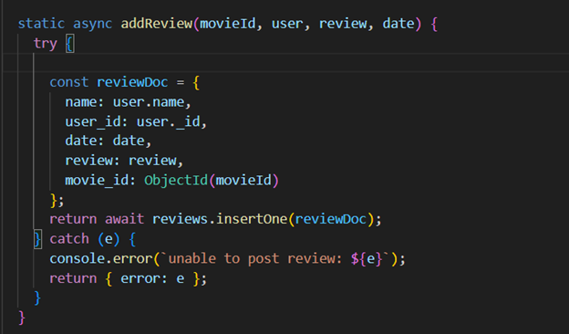  
*Hình 3.3: Hàm `addReview()`*

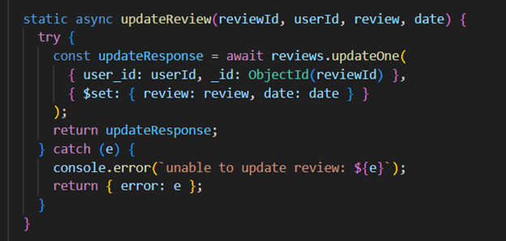  
*Hình 3.4: Hàm `updateReview()`*

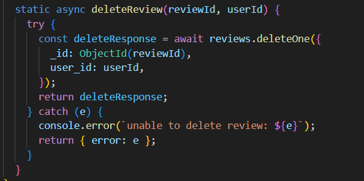  
*Hình 3.5: Hàm `deleteReview()`*

## Kết quả test API (Postman)

### Tạo review
`POST http://localhost:3000/api/v1/movies/review`

Kết quả trả về `{"status":"success"}` nếu thêm thành công.

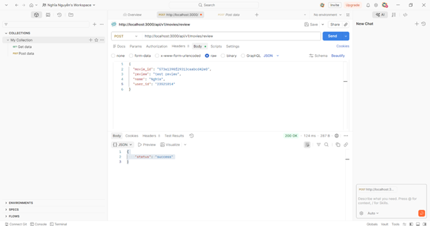  
*Hình 3.6: Test API tạo review*

### Sửa review
`PUT http://localhost:3000/api/v1/movies/review`

Kết quả trả về `{"status":"success"}` nếu sửa thành công.

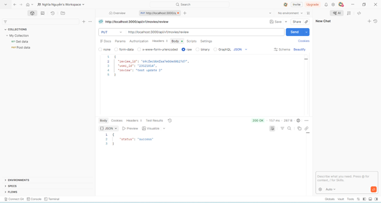  
*Hình 3.7: Test API sửa review*

### Xóa review
`DELETE http://localhost:3000/api/v1/movies/review`

Kết quả trả về `{"status":"success"}` nếu xóa thành công.

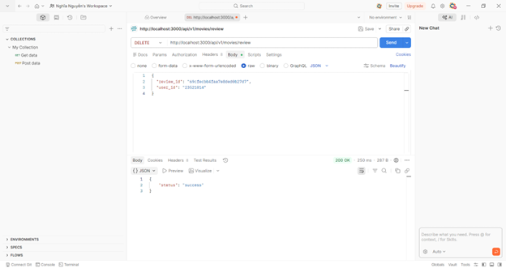  
*Hình 3.8: Test API xóa review*

---

# Bài 4: Hoàn thành back-end cho ứng dụng minh họa

Thêm 2 định tuyến cho người dùng sử dụng các chức năng sau:

- Lấy tất cả thông tin của phim và các review có liên quan dựa trên Id của phim.
- Lấy tất cả các loại rating của phim trên dữ liệu.

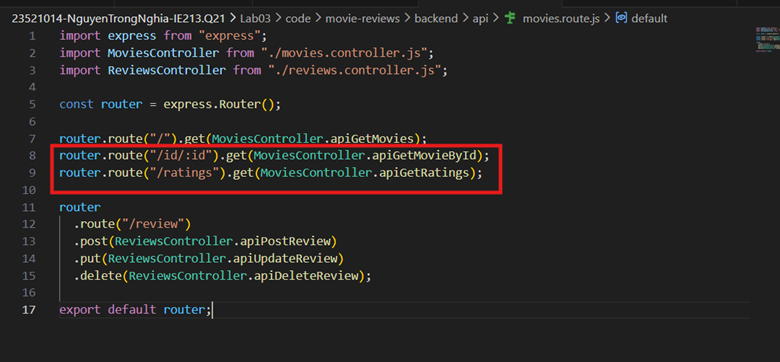  
*Hình 4.1: Mẫu code thêm 2 định tuyến trong `movies.route.js`*

Thêm 2 phương thức controller tương ứng cho 2 định tuyến ở trên là `apiGetMovieById()` và `apiGetRatings()` trong movie controller.

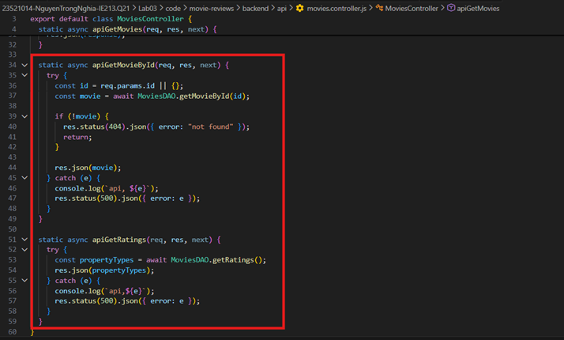  
*Hình 4.2: Mẫu code 2 phương thức controller tương ứng cho 2 định tuyến*

Thêm 2 phương thức DAO tương ứng cho phần 4.2 là `getRatings()` và `getMovieById()` trong DAO movie.

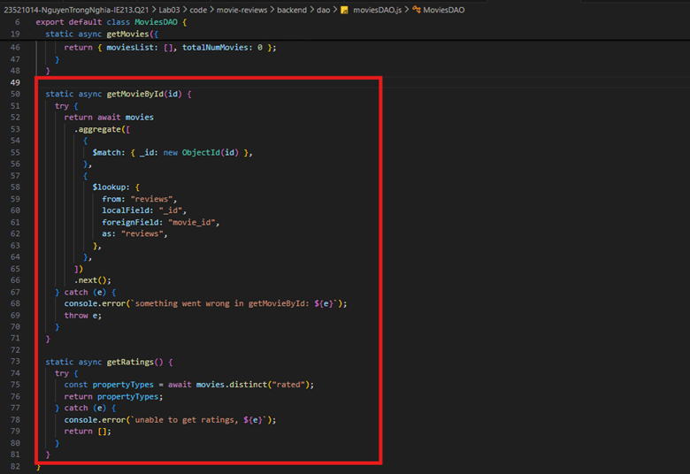  
*Hình 4.3: Mẫu code 2 phương thức DAO tương ứng 2 controller*

## Thử nghiệm các API vừa tạo ở trên

### Lấy thông tin phim theo ID
`GET http://localhost:3000/api/v1/movies/id/:id`

Kết quả trả về thông tin của phim và các review liên quan theo `movie_id` khi thao tác thành công.

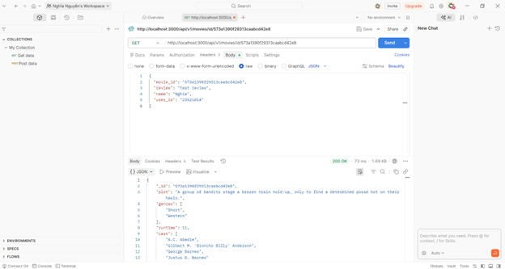  
*Hình 4.4: Test API lấy phim theo ID và danh sách review liên quan*

### Lấy danh sách rating
`GET http://localhost:3000/api/v1/movies/ratings`

Kết quả trả về là một mảng các giá trị rating có trong dữ liệu phim.

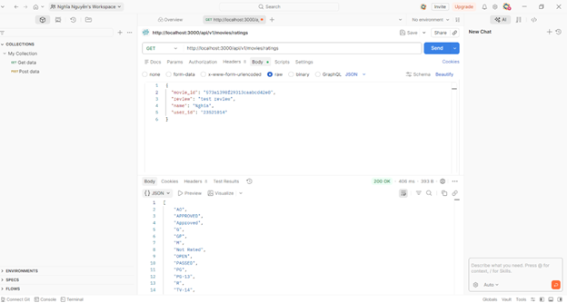  
*Hình 4.5: Test API lấy danh sách rating*
