Mục tiêu bài thực hành là thiết lập frontend cho ứng dụng Movie Reviews bằng React, sử dụng React-Bootstrap để xây dựng giao diện điều hướng và dùng React Router để định tuyến giữa các trang chức năng.  
Công cụ/Môi trường sử dụng: ReactJS, React-Bootstrap, Bootstrap, React Router DOM, Visual Studio Code, Node.js.  

# Bài 1: Thiết lập nơi làm việc với frontend của dự án

## 1.1 Tạo template frontend với React trong thư mục MovieReview

Đầu tiên, chạy lệnh `npx create-react-app frontend` trong thư mục `MovieReview` để tạo project React chuẩn.

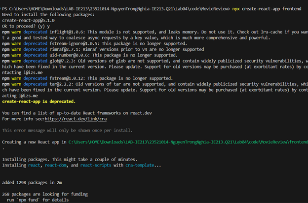  
*Hình 1.1: Chạy lệnh npx create-react-app frontend ở terminal*

Sau khi tạo xong project, chạy lệnh `npm start` để khởi động server tại `http://localhost:3000`.

Kết quả hiển thị trang React mặc định.

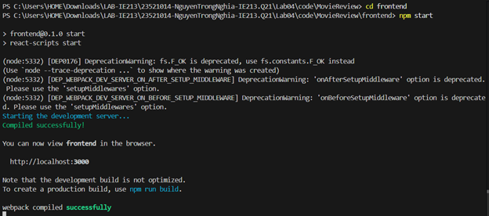  
*Hình 1.2: Chạy server bằng lệnh npm start*

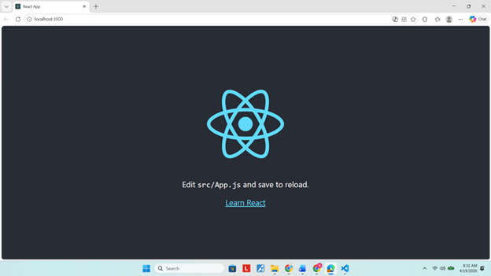  
*Hình 1.3: Trình duyệt hiển thị trang React mặc định*

## 1.2 Cài đặt các package hỗ trợ xây dựng dự án

Tiến hành cài đặt các thư viện cần thiết:

- Chạy lệnh `npm i react-bootstrap bootstrap` để hỗ trợ xây dựng giao diện với Bootstrap.

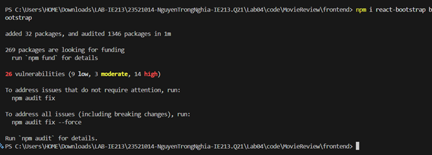  
*Hình 1.4: Cài package Bootstrap*

- Chạy lệnh `npm i react-router-dom` để hỗ trợ định tuyến bằng React Router DOM.

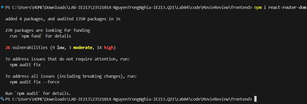  
*Hình 1.5: Cài package React Router DOM*

# Bài 2: Xây dựng Navigation Header bar cho ứng dụng

## 2.1 Tạo các component chức năng trong thư mục components

Navigation bar giúp người dùng định tuyến tới các nội dung trong ứng dụng, vì vậy cần tạo các component sau:

- `movies-list`: hiển thị thông tin danh sách phim.
- `movie`: hiển thị thông tin chi tiết phim và review liên quan.
- `add-review`: hỗ trợ thêm review cho người dùng.
- `login`: trang đăng nhập cho người dùng.

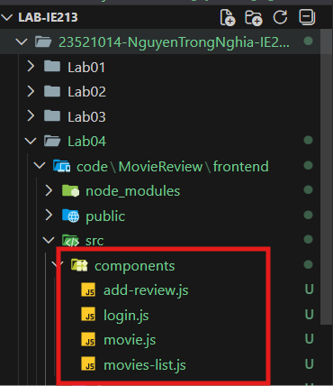  
*Hình 2.1: Tạo các component trong thư mục components*

## 2.2 Đưa Navbar của React-Bootstrap vào App.js

Truy cập tài liệu chính thức tại: `https://react-bootstrap.github.io/docs/components/navbar` để lấy mẫu `Navbar` và tích hợp vào phần JSX của hàm `App()` trong tệp `App.js`.

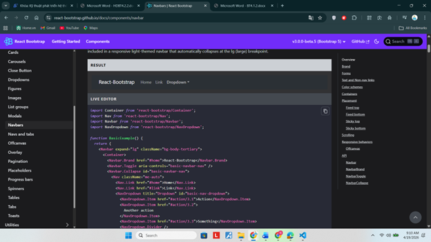  
*Hình 2.2: Mẫu Navbar từ React-Bootstrap*

## 2.3 Điều chỉnh nội dung Navbar theo yêu cầu bài thực hành

Điều chỉnh một số thông tin trên thanh điều hướng:

- Đổi tên logo thành `Movie Reviews`.
- Liên kết thứ nhất đổi từ `Home` thành `Movies`.
- Liên kết thứ hai đổi từ `Link` thành trạng thái `Login/Logout` của người dùng.

Lưu ý: sử dụng React Hook `useState` để lưu giữ và thay đổi trạng thái người dùng đăng nhập, ví dụ: `const [user, setUser] = useState(null);`

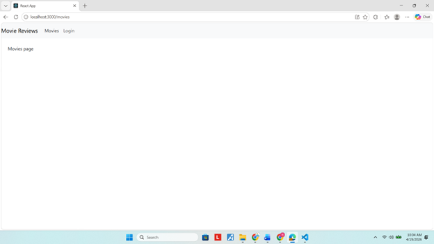  
*Hình 2.3: Điều chỉnh logo và các liên kết trên Navbar*

# Bài 3: Thiết lập định tuyến cho các component

## 3.1 Cấu hình định tuyến bằng Switch trong React Router DOM

Sử dụng thẻ `<Switch>` (import từ `react-router-dom`) để định tuyến cho 4 component đã tạo ở Bài 2.

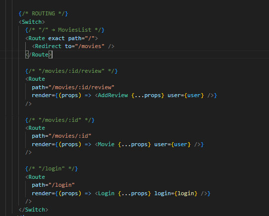  
*Hình 3.1: Cấu hình định tuyến cho 4 component bằng Switch*

Các định tuyến trong hệ thống:

| Đường dẫn | Component | Mô tả |
| --- | --- | --- |
| `/movies` | `MoviesList` | Hiển thị danh sách phim |
| `/movies/:id` | `Movie` | Hiển thị chi tiết phim |
| `/movies/:id/review` | `AddReview` | Thêm review cho phim |
| `/login` | `Login` | Trang đăng nhập |

## 3.2 Kết quả hiển thị giao diện sau khi định tuyến

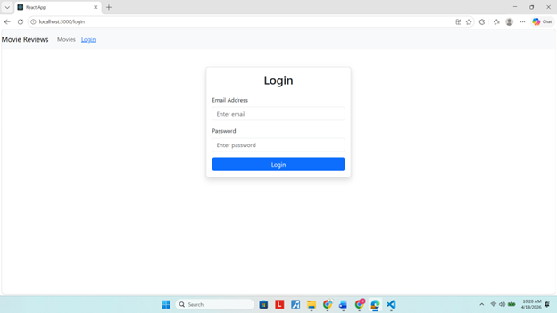  
*Hình 3.2: Trang Login sau khi thiết lập định tuyến*

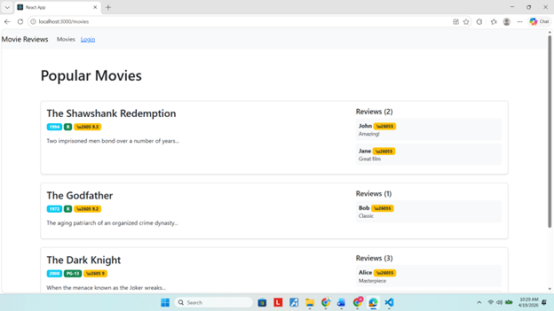  
*Hình 3.3: Trang Movies sau khi thiết lập định tuyến*
