# Mục tiêu

Bài thực hành tập trung vào việc xây dựng ứng dụng Movie Reviews bằng React, kết nối frontend với backend, sử dụng React-Bootstrap để thiết kế giao diện và React Router để định tuyến giữa các trang chức năng.

Công cụ/Môi trường sử dụng: ReactJS, Axios, React-Bootstrap, Bootstrap, React Router DOM, MomentJS, Visual Studio Code, Node.js, MongoDB.

# Bài 1: Kết nối tới Backend

## 1.1 Cài đặt axios cho dự án hiện tại

Đầu tiên, cài đặt thư viện `axios` để thực hiện các HTTP request từ frontend đến backend.

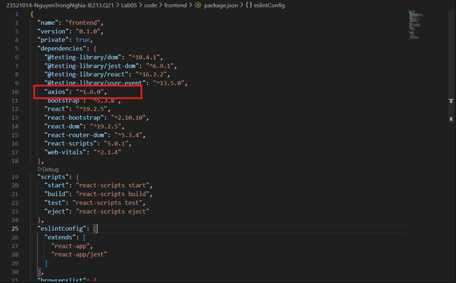
*Hình 1.1: Cài đặt axios cho dự án*

## 1.2 Tạo lớp dịch vụ `MovieDataService` trong `src/services/movies.js`

Tiến hành tạo lớp dịch vụ `MovieDataService` để xử lý các kết nối đến backend.

- Import thư viện `axios`.
- Tạo file `src/services/movies.js`.
- Khai báo lớp `MovieDataService` để dùng chung cho toàn bộ ứng dụng.

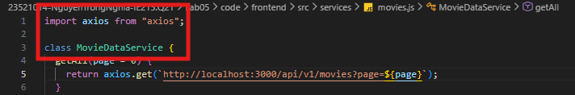
*Hình 1.2: Tạo class MovieDataService trong `src/services/movies.js`*

## 1.3 Tạo các lời gọi dịch vụ tới backend bằng axios

Xây dựng các phương thức gọi API bao gồm: `getAll()`, `get(id)`, `createReview(data)`, `updateReview(data)`, `deleteReview(data)` và `getRatings()`.

- `getAll()` dùng để lấy danh sách phim.
- `get(id)` dùng để lấy thông tin chi tiết của một phim.
- `createReview(data)`, `updateReview(data)`, `deleteReview(data)` dùng để xử lý thêm, sửa và xóa review.
- `getRatings()` dùng để lấy danh sách xếp loại phim.

Kết quả thực hiện cho thấy ứng dụng đã gọi thành công backend bằng các phương thức HTTP của `axios` như `get`, `post`, `put`, `delete`.

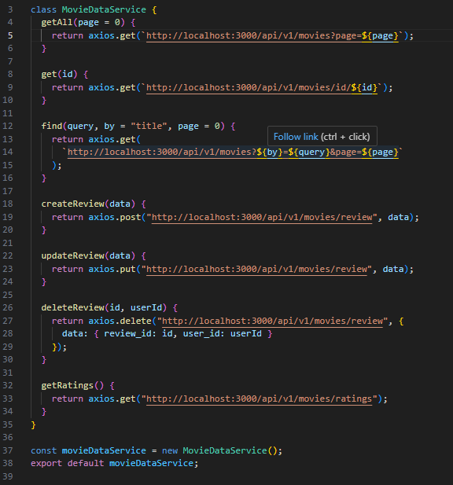
*Hình 1.3: Dùng axios để gọi dịch vụ tới backend tương ứng*

# Bài 2: Xây dựng `MoviesList` Component

## 2.1 Tạo các biến trạng thái với `useState()`

Trong component `MoviesList`, đã tạo các biến trạng thái:

- `movies`
- `searchTitle`
- `searchRating`
- `ratings`

Đồng thời xây dựng các hàm xử lý thay đổi form:

- `onChangeSearchTitle`
- `onChangeSearchRating`

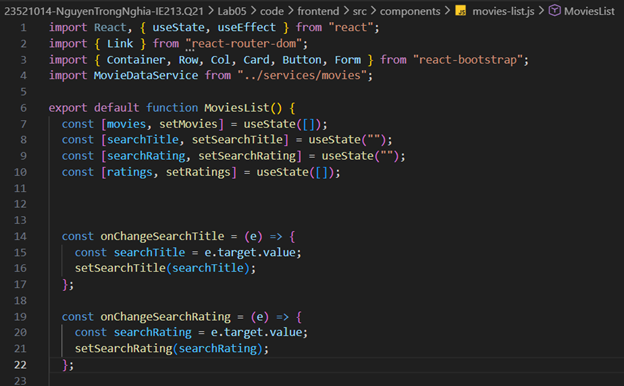
*Hình 2.1: Code khởi tạo biến trạng thái và các hàm xử lý thay đổi form tìm kiếm trong MoviesList component*

## 2.2 Tạo `retrieveMovies()` và `retrieveRatings()`

Đã hiện thực hai phương thức:

- `retrieveMovies()` để lấy danh sách phim từ backend.
- `retrieveRatings()` để lấy danh sách rating và thêm tùy chọn mặc định `All Ratings`.

Hai phương thức này được gọi trong `useEffect()` khi component render lần đầu tiên.

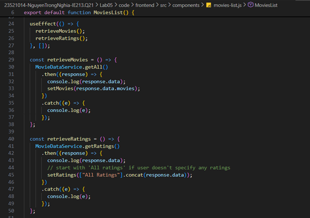
*Hình 2.2: Code hiện thực retrieveMovies, retrieveRatings và gọi trong useEffect*

## 2.3 Tạo 2 search form theo title và rating

Đã xây dựng giao diện tìm kiếm gồm:

- Ô nhập tiêu đề phim để tìm theo title.
- Danh sách chọn rating để tìm theo xếp loại.

Các thành phần `Row`, `Col`, `Form.Control`, `Button` của `react-bootstrap` được dùng để tạo bố cục giao diện.

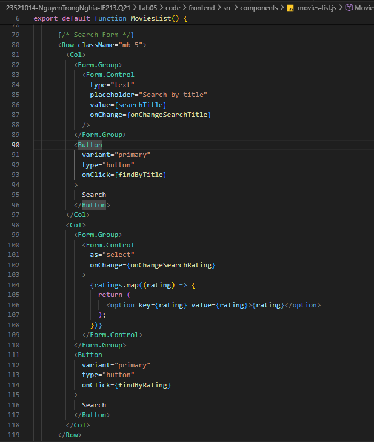
*Hình 2.3: Mã nguồn JSX xây dựng giao diện 2 form tìm kiếm theo Title và Rating*

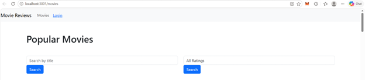
*Hình 2.4: Giao diện hiển thị các form tìm kiếm thực tế trên trình duyệt*

## 2.4 Hiển thị danh sách phim bằng `Card`

Danh sách phim được hiển thị bằng component `Card` của `react-bootstrap`.

- Mỗi phim được hiển thị theo dạng lưới.
- Bao gồm poster, title, rating, plot và liên kết `View Reviews`.

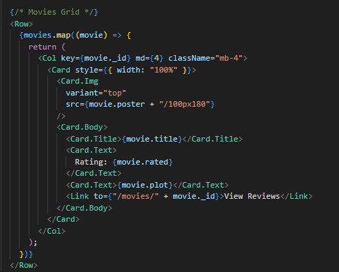
*Hình 2.5: Đoạn mã JSX sử dụng component Card để render danh sách thông tin phim*

## 2.5 Hiện thực `findByTitle()` và `findByRating()`

Đã xây dựng các hàm tìm kiếm:

- `find(query, by)` dùng chung để gọi `MovieDataService.find()`.
- `findByTitle()` tìm theo tiêu đề phim.
- `findByRating()` tìm theo rating, hoặc trả về toàn bộ phim nếu chọn `All Ratings`.

Kết quả chạy ứng dụng cho thấy danh sách phim được hiển thị đúng phía dưới thanh tìm kiếm.

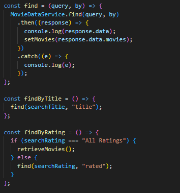
*Hình 2.6: Mã nguồn các phương thức xử lý tìm kiếm*

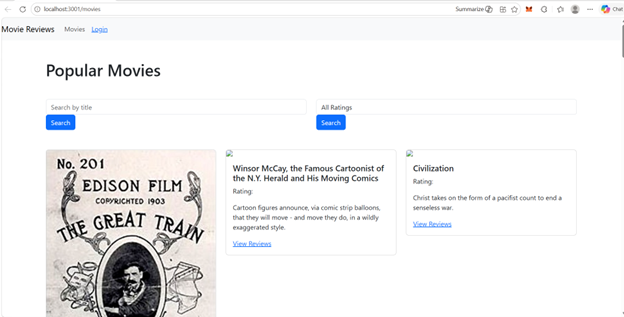
*Hình 2.7: Giao diện sau khi chạy ứng dụng, hiển thị thanh tìm kiếm và danh sách phim dạng Card*

# Bài 3: Hiển thị thông tin trang movie khi nhấn vào `View Reviews`

## 3.1 Thiết lập component `Movie`

Trong file `./components/movie.js`, đã tạo biến trạng thái `movie` để lưu trữ thông tin chi tiết của phim gồm:

- `id`
- `title`
- `rated`
- `reviews`

Đồng thời import các hook và component cần thiết từ `react`, `react-bootstrap`, `react-router-dom` và `MovieDataService`.

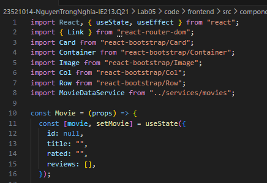
*Hình 3.1: Mã nguồn thiết lập component Movie và biến trạng thái lưu trữ thông tin chi tiết phim*

## 3.2 Xây dựng phương thức `getMovie()`

Đã xây dựng `getMovie(id)` để gọi `MovieDataService.get(id)` và lấy dữ liệu chi tiết của phim dựa trên ID.

- Khi gọi thành công, dữ liệu được cập nhật vào state bằng `setMovie(response.data)`.
- Có xử lý lỗi trong khối `.catch()`.

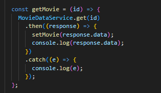
*Hình 3.2: Mã nguồn phương thức getMovie() lấy dữ liệu chi tiết phim từ Backend*

## 3.3 Trang trí JSX cho trang chi tiết phim

Phần JSX của `Movie` đã được xây dựng lại để hiển thị:

- Poster phim ở cột bên trái.
- Tên phim và nội dung `plot` ở cột bên phải.
- Nút `Add Review` chỉ hiển thị khi người dùng đã đăng nhập.
- Khu vực `Reviews` phía dưới.

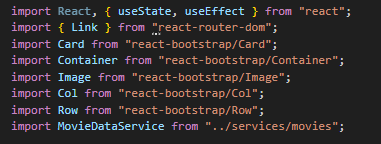
*Hình 3.3: Mã nguồn import các thư viện và component cần thiết cho giao diện*

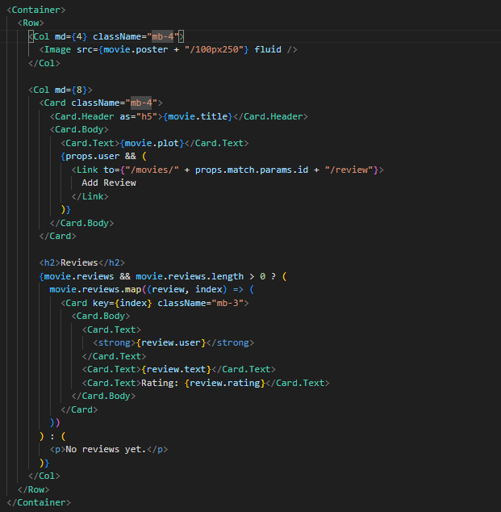
*Hình 3.4: Mã nguồn JSX xây dựng bố cục layout cho trang chi tiết phim*

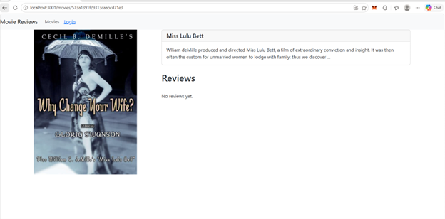
*Hình 3.5: Giao diện trang chi tiết phim hiển thị thực tế trên trình duyệt*

# Bài 4: Hiển thị danh sách review tương ứng cho từng phim dưới phần Plot

## 4.1 Hiển thị danh sách review cho phim

Đã dùng `map()` để duyệt qua `movie.reviews` và hiển thị từng review lên giao diện.

- Hiển thị tên người review.
- Hiển thị nội dung review.
- Sử dụng `moment` để định dạng ngày tháng theo `Do MMMM YYYY`.
- Nút `Edit` và `Delete` chỉ hiển thị khi `props.user.id === review.user_id`.

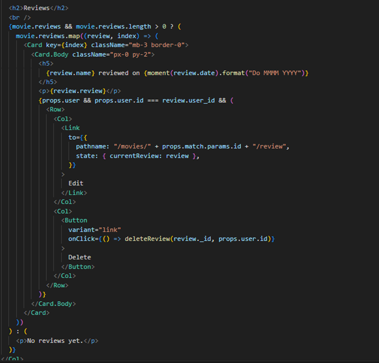
*Hình 4.1: JSX hiển thị danh sách review, định dạng ngày tháng và phân quyền nút Edit/Delete*

## 4.2 Thêm review bằng Postman hoặc Insomnia

Đã thực hành gửi request `POST` đến endpoint:

```text
http://localhost:3000/api/v1/movies/review
```

Dữ liệu gửi đi bao gồm:

- `movie_id`
- `name`
- `user_id`
- `review`

Kết quả trả về thành công với thông báo `status: success`, và review được cập nhật trên giao diện frontend.

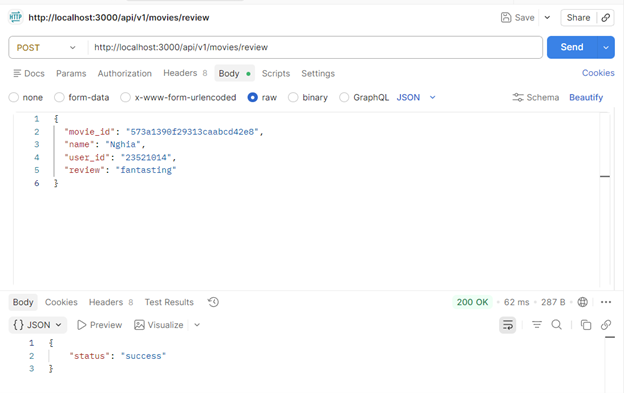
*Hình 4.2: Thực hiện gửi request POST qua Postman để thêm bình luận mới*

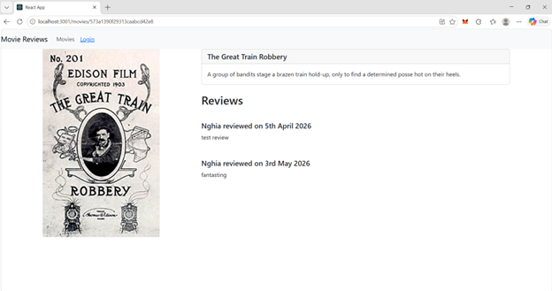
*Hình 4.3: Giao diện chi tiết phim cập nhật thành công bình luận vừa được thêm*

## 4.3 Điều chỉnh hiển thị thời gian bằng `momentjs`

Đã cập nhật cách hiển thị ngày tháng trong phần review bằng cú pháp:

```javascript
moment(review.date).format("Do MMMM YYYY")
```

Cách hiển thị này giúp ngày tháng trực quan và dễ đọc hơn cho người dùng.

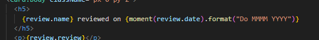
*Hình 4.4: Cập nhật mã nguồn sử dụng thư viện momentjs để định dạng lại thời gian hiển thị*
