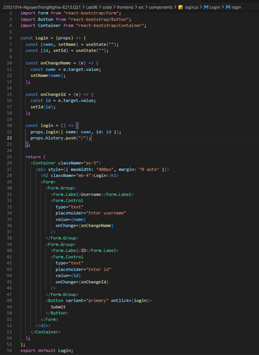
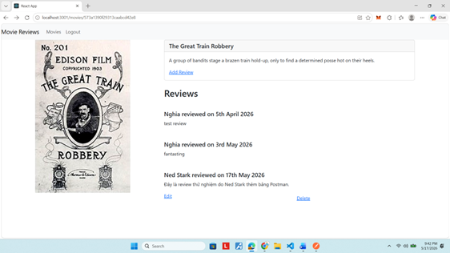
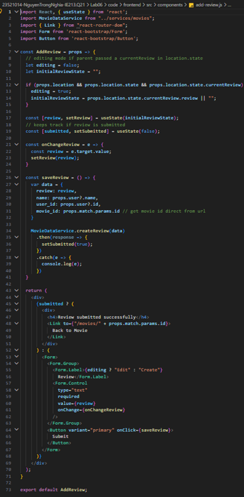
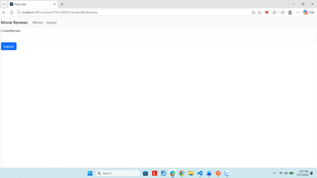
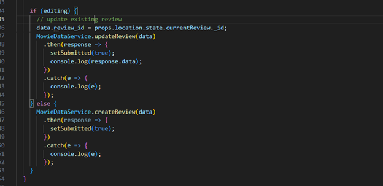
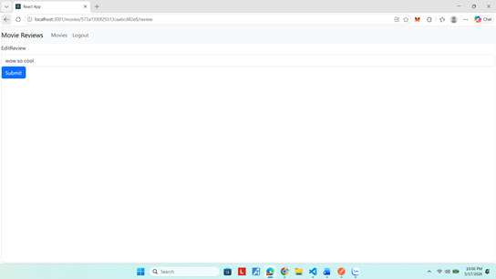
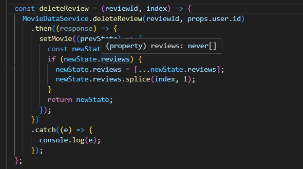
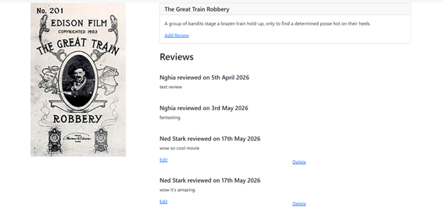
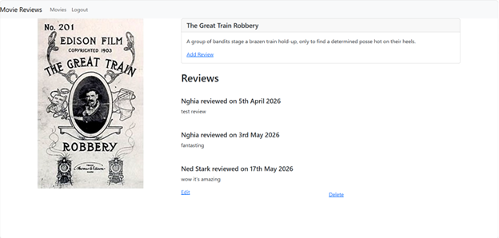
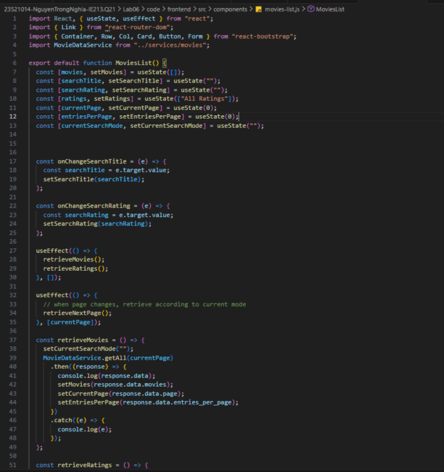

# Lab 06: Movie Reviews - Thêm, Sửa, Xoá Review và Phân Trang

## Mục tiêu

Bài thực hành này giúp sinh viên xây dựng ứng dụng Movie Reviews hoàn chỉnh với các chức năng: đăng nhập, thêm/sửa/xoá review, phân trang và tìm kiếm. Ứng dụng sử dụng ReactJS, React-Bootstrap, React Router, Axios, MomentJS, kết nối backend Node.js/MongoDB.

**Công cụ/Môi trường sử dụng:** ReactJS, Axios, React-Bootstrap, Bootstrap, React Router DOM, MomentJS, Visual Studio Code, Node.js, MongoDB.

---

# Bài 1: Thêm và Sửa Review

## 1.1 Tạo Login Component
**Mục tiêu:** Khi đăng nhập thành công, người dùng sẽ thấy nút Edit và Delete cho các review của chính mình.

**Cách làm:**
- Sử dụng `useState` để quản lý `name` (username) và `id`.
- Hàm `onChangeName`, `onChangeId` cập nhật trạng thái khi nhập liệu.
- Hàm `login` truyền `{ name, id }` lên App, sau đó chuyển hướng về trang chủ.


```javascript
// ...trích đoạn mã nguồn login.js
```

*Hình 1.1: Mã nguồn login component (`login.js`)*

**Kết quả:**
- Chỉ review của user đang đăng nhập mới hiện nút Edit/Delete.


*Hình 1.2: Giao diện chi tiết phim, chỉ review của user mới có Edit/Delete.*

---

## 1.2 Thêm Review
**Mục tiêu:** Cho phép user đã đăng nhập thêm review mới cho phim.

**Cách làm:**
- Biến `editing` mặc định là false.
- `initialReviewState` là trạng thái ban đầu của review.
- `useState` theo dõi nội dung nhập liệu (`review`).
- `submitted` xác nhận đã gửi thành công.
- `onChangeReview()` cập nhật nội dung.
- `saveReview()` đóng gói dữ liệu và gọi `MovieDataService.createReview(data)`.
- Nếu thành công, chuyển sang trạng thái submitted.


```javascript
// ...trích đoạn mã nguồn add-review.js
```

*Hình 1.3: Mã nguồn thêm review (`add-review.js`).*

**Kết quả:**
- Form nhập liệu, nút Submit, thông báo thành công.


*Hình 1.4: Giao diện form thêm review.*

---

## 1.3 Sửa Review
**Mục tiêu:** Cho phép user sửa review của chính mình.

**Cách làm:**
- Nếu `props.location.state.currentReview` tồn tại, chuyển sang chế độ editing.
- `saveReview()` kiểm tra editing, nếu true thì thêm `review_id` vào data và gọi `MovieDataService.updateReview(data)`.
- Nếu không, gọi `createReview` như bình thường.


```javascript
// ...trích đoạn mã nguồn xử lý sửa review
```

*Hình 1.5: Mã nguồn xử lý sửa review.*

**Kết quả:**
- Khi bấm Edit, form chuyển sang chế độ sửa, tự động điền nội dung cũ.


*Hình 1.6: Giao diện form Edit Review.*

---

# Bài 2: Xoá Review

**Mục tiêu:** Cho phép user xoá review của chính mình.

**Cách làm:**
- Nút Delete truyền `review._id` và `index` vào hàm `deleteReview`.
- `deleteReview()` gọi `MovieDataService.deleteReview(reviewId, userId)`, nếu thành công thì xoá review khỏi mảng bằng `splice(index, 1)` và cập nhật lại state.


```javascript
// ...trích đoạn mã nguồn deleteReview trong movie.js
```

*Hình 2.1: Mã nguồn hàm deleteReview.*

**Kết quả:**
- Review bị xoá ngay trên giao diện, không cần tải lại trang.


*Hình 2.2: Giao diện trước khi xoá review.*


*Hình 2.3: Giao diện sau khi xoá review.*

---

# Bài 3: Phân Trang và Tìm Kiếm

**Mục tiêu:** Hiển thị danh sách phim theo trang, hỗ trợ tìm kiếm theo tiêu đề và rating.

**Cách làm:**
- Thêm các state: `currentPage`, `entriesPerPage`, `currentSearchMode`.
- `retrieveMovies()` gọi `MovieDataService.getAll(currentPage)`, cập nhật lại các state.
- Khi đổi trang (`currentPage`), gọi lại API phù hợp với chế độ tìm kiếm hiện tại (`retrieveNextPage`).
- Khi đổi chế độ tìm kiếm (`currentSearchMode`), reset về trang 0.


```javascript
// ...trích đoạn mã nguồn phân trang và tìm kiếm trong movies-list.js
```

*Hình 3.1: Mã nguồn phân trang và tìm kiếm trong `movies-list.js`.*

**Kết quả:**
- Có nút chuyển trang, hiển thị số trang hiện tại, tìm kiếm theo tiêu đề/rating.

---


